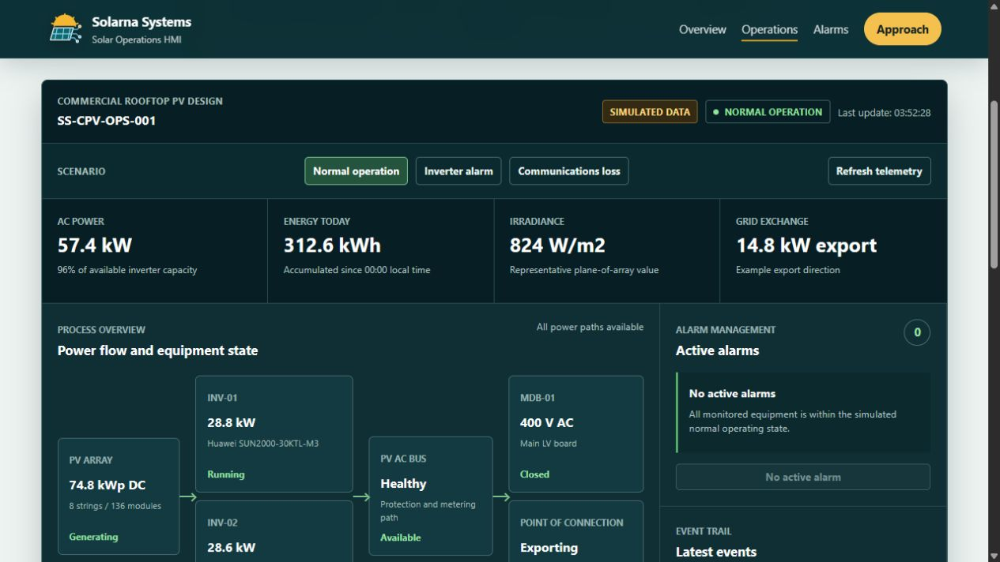

# Solarna Systems

Electrical engineering, automation, and technical software, founded by
Majd Ben Chobba.

[Services and contact](https://solarnasystems.com/) ·
[Try the solar HMI prototype](https://solarnasystems.com/samples/solar-operations-hmi.html) ·
[Open SolarnaPV](https://pv.solarnasystems.com/)

*Public HMI prototype, captured 24 September 2026. All displayed telemetry is
simulated. It is not connected to field equipment and sends no plant commands.*

## Explore a concrete example

The [solar operations HMI](https://solarnasystems.com/samples/solar-operations-hmi.html)
demonstrates an operator workflow:

1. Read PV power, daily energy, grid exchange, and equipment state.
2. Switch between normal operation, an inverter alarm, and communications loss.
3. Compare the alarm, event history, and data-quality indicators.

The website also provides an
[illustrative rooftop PV design](https://solarnasystems.com/samples/commercial-rooftop-pv-demo.html)
and its [single-line drawing](https://solarnasystems.com/samples/commercial-rooftop-pv-sld.html).
These are capability samples, not client projects or construction documents.

## Engineering and delivery

- Solar PV studies, electrical system design, equipment schedules, and documentation.
- PLC operating sequences, interlocks, alarm logic, and commissioning support.
- Monitoring interfaces, data integration, and technical web applications.

A project moves from assessment and an agreed scope through implementation,
review, and handover. [Discuss a project](https://solarnasystems.com/#contact)
with the required output, equipment, and timeline.

## Public applications and source

[SolarnaPV](https://pv.solarnasystems.com/) provides a public interface for PV
site analysis and production planning; its implementation remains private.
[Solara](https://usesolara.pages.dev/) is the separate software-workspace product.

This repository is a business and engineering showcase. Client records,
deployment configuration, and proprietary implementation are not published here.
